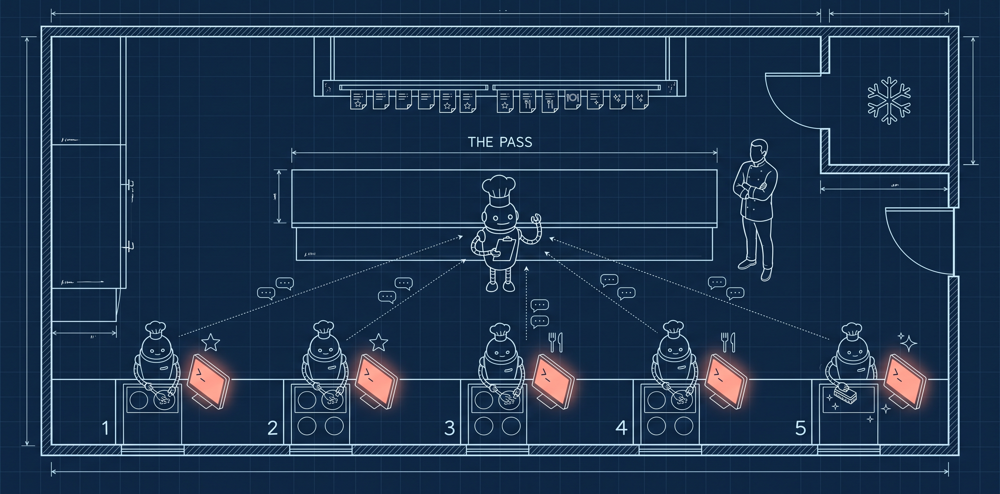

# The Brigade

[](https://github.com/mhmzdev/claude-code-brigade/actions/workflows/check.yml)



Run a kitchen of Claude Code sessions. One **sous chef** leads, a few **line cooks** work
one ticket each at their own **station**, and you are the **head chef**: you approve
plans and you merge. The sessions talk to each other with `SendMessage`. There is no
daemon, no queue, and no database.

> Inspired by Steve Yegge's *[The Shape of Things to Come](https://yegge.ai/essays/the-shape-of-things-to-come/)*
> and *[Model Welfare for Agentic Engineers](https://yegge.ai/essays/model-welfare/)*.
> Gas Town is a city of agents. The Brigade is the same idea at the scale of one engineer
> and one laptop.

## Contents

- [Why a kitchen](#why-a-kitchen)
- [The cast](#the-cast)
- [The three lanes](#the-three-lanes)
- [The rules](#the-rules)
- [Install](#install)
- [Set up a repo](#set-up-a-repo)
- [Stations: clones or worktrees](#stations-clones-or-worktrees)
- [Run a service](#run-a-service)
- [What a service looks like](#what-a-service-looks-like)
- [Long services: clearing sessions](#long-services-clearing-sessions)
- [What's in the box](#whats-in-the-box)
- [Troubleshooting](#troubleshooting)
- [Honest limits](#honest-limits)
- [Status](#status)

## Why a kitchen

A professional kitchen already solved this problem: several people working in parallel,
in one shared room, under time pressure, with one person checking every plate before it
goes out. Escoffier's *brigade de cuisine* gives every station one owner, turns every order
into a ticket, and puts one gate between the kitchen and the customer: **the pass**.

## The cast

| Kitchen | In the harness |
|---|---|
| **Head Chef** | you: sign off plans, answer real forks, merge, deploy |
| **Sous Chef** | the lead session: assigns tickets, answers routine questions, is the only one who writes the rail, reviews every diff at the pass |
| **Line Cook** | a worker session: one ticket, plan to PR |
| **Station** | a gitignored clone at `stations/station-N` |
| **The Walk-in** | shared local resources (a database, a docker stack) that one cook could break for everyone |
| **The Rail** | where tickets live: markdown in `docs/` (default), GitHub Projects, or Jira |
| **Health Inspector** | `inspector`, a report-only sub-agent: flags what a reviewer would reject in a diff |
| **Taster** | `taster`, a sub-agent the sous sends to the pass: reads the diff, re-runs the check, walks "Done when", returns a verdict |
| **Runner** | `runner`, a sub-agent anyone uses to run a noisy command and get back only pass/fail plus the failing lines |

The full table, plus an Urdu alternate (Qafila), is in [`docs/the-names.md`](docs/the-names.md).

## The three lanes

| Lane | Source | Path |
|---|---|---|
| **A — Specials** | a spec, sliced into tickets | brainstorm → grill-me → spec → file-tickets → create-plan → implement → review-task → open-pr |
| **B — À la carte** | tickets already on the rail | pick-ticket → (grill-me) → create-plan → implement → review-task → open-pr |
| **C — Clean as you go** | the kitchen finds its own mess: `/bk:clean scan` | pick-ticket → implement → open-pr |

## The rules

1. **One cook, one ticket, one shift.** Clear the session before its next ticket.
2. **If it's on the rail, it's taken**, even if you can't see the plan: it's in another station.
3. **Nobody empties the walk-in without calling it.** Ask the sous before a reset.
4. **One migration in flight at a time.**
5. **Two tickets on the same files go to the same cook**, in sequence.
6. **The chef signs the recipe, the sous checks the plate.** The sous never speaks for the chef on merge or deploy.
7. **Call for decisions, not ceremony.** Routine questions go to the sous; only real forks reach you.
8. **Trust the cook at the station.** When a cook says the sous is wrong about its station, the cook wins.

## Install

Skills are invoked as `/bk:<skill>`, where `bk` is short for *brigade kitchen*.

In Claude Code:

```
/plugin marketplace add mhmzdev/claude-code-brigade
/plugin install bk@claude-code-brigade
```

Or commit it for your whole team in `.claude/settings.json`:

```json
{
  "extraKnownMarketplaces": {
    "claude-code-brigade": {
      "source": { "source": "github", "repo": "mhmzdev/claude-code-brigade" }
    }
  },
  "enabledPlugins": { "bk@claude-code-brigade": true }
}
```

You need a Claude Code version where sessions on one machine can see each other
(`ListAgents`) and message each other (`SendMessage`). All sessions must run under the
same `CLAUDE_CONFIG_DIR`.

## Set up a repo

At the repo root, with a clean working tree:

```
/bk:setup               # detects the station kind and recommends it
/bk:setup --worktree    # or pick it yourself: worktrees next to the repo
/bk:setup --clone       #                      clones inside the repo
```

Run it **inside the product repo** you want to work on. In a workspace that holds several
repos, `cd` into one of them first. Setup refuses a workspace root, because a station
cloned from it would contain none of the repos inside it.

It reads the repo, asks one round of questions, and writes:

```
.claude/brigade.md          # config: trunk, check command, walk-in, rail adapter
docs/specs/001-<slug>.md    # specs; their tickets in docs/specs/001-<slug>/01-<slug>.md
docs/backlog/BKLG-001-*.md  # standalone tickets;  HYG-001-*.md for hygiene
docs/plans/  docs/checklists/  docs/research/  docs/brainstorm/
stations/station-1 …        # gitignored clones, one per cook
```

It ends with **one** question: *commit, push, create the stations and open the kitchen?*
It's one step because stations are fresh clones of `origin/<trunk>`: until the setup is
pushed, a station would start without it.

Tickets carry their status in frontmatter. There is no summary page to keep in sync:
`kitchen.sh rail` computes the board each time.

## Stations: clones or worktrees

Each cook works in a **station**. There are two kinds, set by `kitchen_mode:` in
`.claude/brigade.md`:

| | `clone` (default) | `worktree` |
|---|---|---|
| Where | `<repo>/stations/station-N`, gitignored | `../<repo>-stations/station-N`, next to the repo |
| What | a full clone | a git worktree: one shared history, one `git fetch` |
| Best for | one standalone repo | big repos, and repos inside a workspace repo |
| Idle station | on trunk | detached at `origin/<trunk>` (trunk is checked out in your main folder) |

A workspace that holds several repos, each gitignored by the outer repo, can't be cloned
per station. Worktrees handle it: `sastaticket-mobile-app/` keeps its stations in
`sastaticket-mobile-app-stations/`, and setup adds that folder to the **workspace's**
`.gitignore`. Cooks there also load the workspace's `CLAUDE.md`.

Two worktree habits: stashes are shared between stations (stash with
`-m "<station>: …"` and apply only your own), and remove stations with
`/bk:kitchen remove`, never `rm -rf`. `/bk:setup` recommends the mode for you, or pass `--worktree` / `--clone`.

## Run a service

1. In the main checkout: `/bk:sous-chef`. With no cooks yet, it tells you so and waits.
2. From the sous (or any terminal): `/bk:kitchen open`. Each station opens **already running
   `/bk:line-cook`**, finds the sous and checks in. There's nothing to type in the stations.
3. Tell the sous which ticket to fire, or ask it to propose one per lane.

A cook's plan and checklist are written in its station and reach trunk with its PR, not
before. Specs and tickets are written by the sous in the main checkout and reach trunk
straight away.

**Cook names.** `kitchen open` names the session in station-N `<repo>-cook-N` (Claude
Code's `--name`), e.g. `my_app-cook-2`: the station is the place, the cook is who works
there. It's the name in the terminal title, in `/resume`, and in the sous's session list;
the repo prefix keeps two kitchens on one machine apart. Cooks start in Claude Code's
`auto` permission mode, since nobody watches their terminals between gates (set
`permission_mode:` in the config to change it).

**The start order doesn't matter.** A cook that comes up before the sous says it's waiting;
when the sous starts it sends `[hello]` to cooks in its stations, and they check in. Prefer
plain sessions? `kitchen open --bare`, then name them to the sous (`/bk:sous-chef @one @two`);
its brief tells each one it's a line cook.

**What you type during a service.** Invoking a skill *is* the approval for its whole job, so
no skill asks "does this look right?" or "go on to phase 2?". Per ticket you type two
things: `/bk:implement` in the cook's terminal once its plan is ready (the sign-off: only a
human can start `implement`), and the merge. Real design forks reach you too.

## What a service looks like

Sessions talk in short typed messages, so you can follow a ticket by reading them:

```
cook  → sous   [check-in]  station-1 · Opus · main · clean · no ticket
sous  → cook   [brief]     BKLG-001: /abs/path/to/ticket.md, constraints, the loop
cook  → sous   [rail]      claim BKLG-001 todo
                           … the cook writes the plan, presents it, stops …
you   (cook's terminal)    /bk:implement        ← the sign-off
cook  → sous   [rail]      BKLG-001 → in-progress
cook  → sous   [gate]      BKLG-001 Q1, see journal → sous answers; cook copies it in as A1
cook  → sous   [handoff]   ready for the pass: branch, files, check green, inspector clean
                           … the sous sends the taster; reads its verdict …
sous  → cook   [findings]  1. file:line — why   (or)   [go]
                           … on [go]: clean around, handoff into the journal, then open-pr …
cook  → sous   [served]    PR #12
sous  → PR                 LGTM comment
                           … YOU merge; the sous closes BKLG-001 on the rail …
```

Only two moments need you: typing `/bk:implement` (the sign-off) and the merge. Real design forks reach you
too; everything routine stays between the sous and the cooks.

## Long services: clearing sessions

A model works best early in its context window; well before it's full, the noise starts to
cost. The Brigade treats a context window as a **cache, not the record**. Everything a fresh
session needs is on disk, so any session can be cleared at a quiet point and a new one carries
on. No `/compact` needed.

| What | Where | Written by |
|---|---|---|
| tickets and their status | the rail (`docs/specs/`, `docs/backlog/`) | the sous |
| a ticket's plan and checklist | `docs/plans/`, `docs/checklists/` | its cook |
| **a ticket's journal**: questions and answers, findings, decisions, handoffs, lessons | `docs/journal/<ID>-<slug>.md`, lands with the PR | its cook, only |
| the sous's own notes: your standing instructions, what's next | `.claude/sous-handoff.md`, gitignored | the sous |

- **Cooks:** `/clear` after every PR, as always. Clearing mid-ticket is fine too: run
  `/bk:handoff`, `/clear`, then type the next skill (e.g. `/bk:implement`). A session inside
  a station knows it's a cook, and it resumes from the journal's last handoff.
- **The sous:** when its context grows (you'll see it in the status line), run `/bk:handoff`,
  `/clear`, `/bk:sous-chef`. The new sous reads its note, lists open questions
  (`kitchen.sh questions`), and says hello; cooks re-send whatever they were waiting on.
- **Less to clear in the first place:** the sous reviews through the `taster`, and anyone can
  push noisy commands through the `runner`, so diffs and logs stay out of the main context.

**Lessons are promoted by rule, not by mood.** Cooks write one-line `lesson(repo)` or
`lesson(plugin)` entries in their journal handoffs. At each sous handoff, `kitchen.sh lessons`
counts them by ticket: a repo lesson seen in two tickets becomes a ticket to promote it into
`CLAUDE.md` (reviewed and merged like any change); a lesson about the Brigade itself becomes a
drafted issue on this repo, filed only on your OK.

## What's in the box

| Skill | Does |
|---|---|
| `setup` | set up a repo |
| `kitchen` | stations: setup, open, sync, status, files in flight, the rail board |
| `sous-chef` / `line-cook` | take the lead or worker role |
| `rail` | list, read, claim, fire, link, close: markdown, GitHub or Jira |
| `brainstorm` · `grill-me` · `spec` · `file-tickets` | lane A, from idea to tickets |
| `pick-ticket` · `create-plan` · `implement` · `review-task` · `open-pr` | from ticket to PR. `implement` is typed by you: it's the sign-off |
| `clean` | `check` your own diff (every ticket), `around` your station at end of shift, `scan` the kitchen; hygiene drafts go to the sous |
| `handoff` | write this session's handoff (cook: journal section; sous: local note) so it can be cleared |
| agents: `taster` · `runner` · `inspector` | review at the pass · run noisy commands · report what a reviewer would reject |

Every skill works **solo** too: without a sous, you are both chef and sous.
The shared rules every skill follows are in [`plugins/bk/skills/README.md`](plugins/bk/skills/README.md).

## Troubleshooting

| You see | Why | Do |
|---|---|---|
| `kitchen open`: "No stations yet" | stations haven't been created, usually because the setup isn't pushed | commit + push the setup, then `/bk:kitchen setup` (or just run `/bk:kitchen open` and say yes) |
| a station is **dirty right after setup** | the install step, or an edit that reached into `stations/`, changed tracked files | `git -C stations/station-N diff`, fix the cause in the main checkout, then `git -C stations/station-N checkout -- .` |
| the sous can't find a cook (or the reverse) | sessions only see each other under the same Claude Code profile | start every session with the same `CLAUDE_CONFIG_DIR` (`kitchen open` passes yours through) |
| "1 plugin failed to update" after upgrading from 0.1 | 0.2 renamed the plugin `brigade` → `bk` | `/plugin uninstall brigade@claude-code-brigade`, `/plugin install bk@claude-code-brigade`, and drop any `brigade@…` line from `.claude/settings*.json` |

## Honest limits

- One machine. Two to five cooks, not a fleet.
- The sous is a second fence, not a replacement for your review. You still merge.
- It costs more tokens than one session. Use it when the work is really parallel.
- Stations live inside the repo, gitignored. **Never run `git clean -fdx`** there, and
  exclude `stations/` from tools that don't read `.gitignore` (setup helps with this).

## Status

**v0.7.** `kitchen open` without Warp now opens the machine's own terminal (Terminal.app,
Windows Terminal or mintty, or the Linux desktop's) instead of tmux, and prints the commands
only when there is none. Warp is also found in `~/Applications` and on Linux. tmux is still
there with `--terminal tmux`. To grow a kitchen, run `kitchen setup -n 4`: existing stations
stay put, and `open` now opens every station, not just the configured count, skipping any
station where a cook is already running.

**v0.6.** Long services: ticket journals, `/bk:handoff` for cooks and the sous, lessons
promoted by count, the `taster` and `runner` sub-agents, and cleaning in three scopes. A
session inside a station is a cook even after `/clear`. `clean` is no longer human-only, so
cooks run it in their loop.

**v0.5.** Skills no longer ask for approval they already have; `review` is now
`review-task`; cooks start themselves and check in in either order.

**v0.3.** Tried on a real repo (a Flutter package): setup, stations, `kitchen open`, and
the sous ↔ cook check-in all work. v0.3 adds worktree stations, tested in a nested
workspace layout; clone mode is unchanged. A full ticket, from brief to merged PR, is the next
thing being run. Issues and PRs welcome.

MIT © Muhammad Hamza
